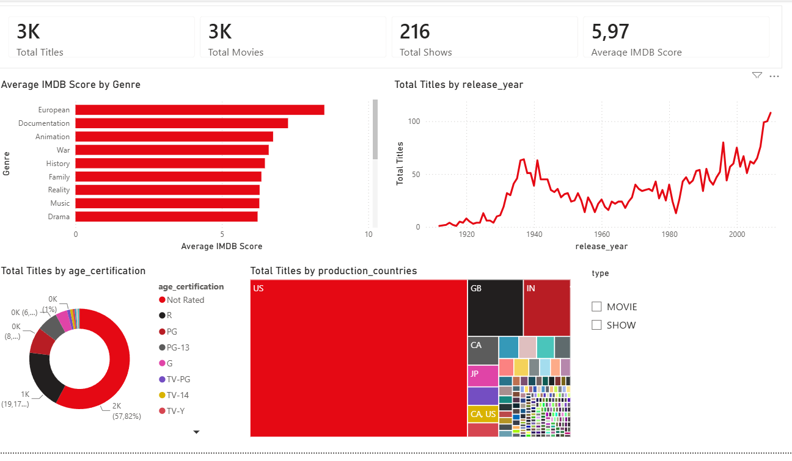

# Netflix Content Analysis — Power BI Case Study

An end-to-end Power BI analysis of the Netflix catalogue: two raw Excel files,
some careful cleaning, and a two-page interactive dashboard.

Built by [Baraa Elhadi](https://linkedin.com/in/baraa-othman-64b4ba224) as
part of an application case study. The dataset is public Netflix content data.

---

## What this is

Two Excel files came in raw. I cleaned them, modelled them, and built a
Power BI dashboard that answers three simple questions:

1. What is actually in this catalogue?
2. Which content is rated well?
3. Which actors and directors appear most often?

Every fix is a named step in Power Query so anyone can open the file, follow
the pipeline, and understand exactly what was changed and why.

---

## The dataset

Two files, joined through the title ID.

| File | Rows | Content |
|---|---|---|
| `Title.xlsx` | 3,472 | Movies and shows with release year, runtime, genre, age certification, IMDB score, TMDB score |
| `Actors.xlsx` | 124,235 | Cast and crew credits linked to titles |

---

## Dashboard structure

**Page 1 — Content Overview**



Built so someone can understand the whole catalogue in one look.

- KPI cards: Total Titles, Total Movies, Total Shows, Average IMDB Score
- Bar chart: Average IMDB Score by Genre (sorted, best first)
- Line chart: Total Titles by Release Year (100-year view, growth after 2000 visible)
- Donut chart: Titles by Age Certification (Not Rated kept as its own group)
- Treemap: Titles by Production Country (about 60 countries; US dominance visible immediately)
- Type slicer: filter the whole page to Movies or Shows only

**Page 2 — Top Actors and Directors**

Uses the join between the two files to answer questions neither file could
answer alone.

- Top 10 Actors by Credits (distinct count of titles per actor, filter by role = ACTOR)
- Top 10 Directors by Titles (same idea, ties kept instead of cut off randomly)
- Top Rated Titles table (best IMDB scores with vote counts, because a 9.0 from 30 votes means less than an 8.5 from a million)

All visuals filter each other on click.

---

## Data preparation

Before building any visual I looked closely at the raw files. Every problem
I found is fixed as a named step in Power Query. I did not change anything
by hand in the Excel files.

**Corrupted rows.** About 14 rows in `Title.xlsx` were structurally broken.
Commas inside descriptions had pushed values into the wrong columns. These
could not be repaired safely, so I removed every row where `type` was not
`MOVIE` or `SHOW` and documented the decision.

**Duplicates.** 44 title IDs and 56 actor rows appeared twice. Duplicated
titles were exact copies, so I kept the first and removed the rest. Without
this step, counts and averages would be inflated.

**Broken characters.** Some text contained wrong symbols (for example `’`
where an apostrophe should be). Repaired the most common cases in title and
description with replace steps.

**Excel error cells.** Some cells contained `#NAME?` and similar errors.
Replaced all error values with empty cells so the model loads cleanly.

**Missing values.**
- 1,984 titles have no age certification → filled with `Not Rated` so they
  stay visible as their own group.
- Missing character names → filled with `Unknown`.
- Missing IMDB scores → left empty on purpose. Filling with an invented
  number would distort the exact metric the dashboard measures.

**Data types.** `release_year` and `runtime` set to whole numbers, ratings
set to decimals. Culture set to `en-US` so decimal points are read
correctly on any machine.

**Small clean-ups.** `country` came in a strange format like `['US']` and
was cleaned to plain codes like `US`. Genre names trimmed and capitalised.

---

## Data model

Two tables connected through the title ID: many credits belong to one
title, so it is a many-to-one relationship. This connection is what makes
Page 2 possible, for example counting how many titles one director made.

---

## DAX measures

Every KPI on the dashboard has one clear definition, written as a DAX
measure instead of dragging raw fields into visuals.

```dax
Total Titles = COUNTROWS(titles)

Total Movies = CALCULATE(COUNTROWS(titles), titles[type] = "MOVIE")

Total Shows  = CALCULATE(COUNTROWS(titles), titles[type] = "SHOW")

Average IMDB Score = ROUND(AVERAGE(titles[imdb_score]), 2)

Average Runtime (min) = ROUND(AVERAGE(titles[runtime]), 0)

Actor Credits =
  CALCULATE(DISTINCTCOUNT(Actors[title_id]), Actors[role] = "ACTOR")

Directed Titles =
  CALCULATE(DISTINCTCOUNT(Actors[title_id]), Actors[role] = "DIRECTOR")
```

---

## Design decisions

- Custom theme in Netflix red (`#E50914`) on dark grey text and a white
  background. Fits the origin of the data, keeps visuals consistent.
- Every visual title is written as a plain sentence about what the chart
  shows, so nobody has to guess.
- Clicking on any bar, slice or country filters the rest of the page. The
  report is a small self-service tool, not just a picture.

---

## Known limitations

- `Actors.xlsx` contains around 66,000 credits pointing to titles that are
  not present in `Title.xlsx`. Kept in the model and documented, rather
  than deleted silently. They do not change any title-level numbers.
- Titles with several production countries are shown as a combined code
  like `CA, US`. A proper country table with a many-to-many relationship
  would be the cleaner next step.
- The 14 corrupted rows (~0.4% of the data) were removed. With more time
  I would try to rebuild them from the raw text with a small script.

---

## Files in this repo

| File | What it is |
|---|---|
| `Netflix_Content_Analysis_Baraa_Elhadi.pbix` | The Power BI file (open in Power BI Desktop) |
| `Dashboard_Documentation.docx` | Full documentation of every visual, its goal, and the reasoning behind the design |
| `Written_Answers.docx` | Five essay answers on data quality, ethics, missing values, stakeholder communication, and finding opportunities in non-data departments |
| `screenshots/` | PNG exports of both dashboard pages |

---

## How to open

1. Install [Power BI Desktop](https://powerbi.microsoft.com/desktop/) (free).
2. Open `Netflix_Content_Analysis_Baraa_Elhadi.pbix`.
3. Open the ribbon *Home → Transform data* to see every Power Query step
   in the pipeline.
4. Open *Data view* to see the two tables and the model relationship.

---

## Contact

Baraa Elhadi
[baraahady20@gmail.com](mailto:baraahady20@gmail.com)
[LinkedIn](https://linkedin.com/in/baraa-othman-64b4ba224)
